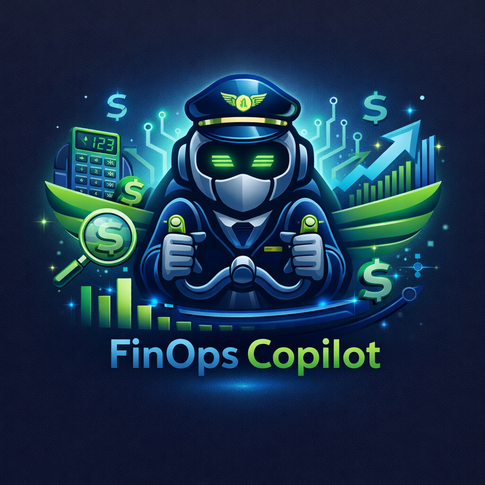

# <p align="center">
  
</p>

# FinOps Copilot — Agentic Cost Intelligence Engine

> **Not a dashboard. Not a report generator.** FinOps Copilot detects anomalies, diagnoses root causes (with LLM self-critique), recommends actions, executes approved changes, and persists the entire audit trail to Supabase — closing the full autonomous loop.

---

## Architecture


### Agent Pipeline (6 Stages)

| Stage | Agent | What It Does |
|-------|-------|-------------|
| 1 | **Ingestion** | Reads 14 datasets from Supabase, profiles data quality, LLM narrates issues |
| 2 | **Anomaly Detection** | 11 detection checks — spend spikes, duplicate vendors, SLA breaches, shadow IT, fraud, overpaying, invoices |
| 3 | **Orchestrator** | Routes each anomaly to the correct specialist agent based on type |
| 3a | **Specialist Agents** | **Process**: LLM root cause diagnosis → **Reflection**: LLM self-critique and refinement |
| 4 | **Action Recommendation** | LLM-powered prioritized action playbooks with savings math |
| 5 | **Verification** | LLM validates against business rules, splits auto/human approval |
| 6 | **Execution** | Auto-executes low-risk actions, stages high-value ones with escalation briefs |

### Frontend Dashboard (5 Pages)

| Page | Purpose |
|------|---------|
| **Overview** | Financial metric cards (exposure, savings, ROI), anomaly distribution, recent runs |
| **Anomalies** | Filterable data table — type, severity, entity, $ impact, expandable evidence |
| **Action Center** | Pending human-approval cards with Approve / Reject buttons → writes to Supabase |
| **Audit Trail** | Searchable timeline of every agent event, filterable by agent/type/severity |
| **Pipeline Runs** | Historical runs with drill-down into execution results |

---

## Core Capabilities

### 1. Duplicate Vendor Detection
> Given a procurement dataset with 500+ vendors, identify duplicates, quantify savings, generate prioritized action plan.

| Component | Implementation |
|-----------|---------------|
| Detection | `vendor_tools.py` — RapidFuzz fuzzy matching (similarity ≥ 0.80) |
| Savings | `calculate_consolidation_savings()` — sums duplicate contract values |
| Diagnosis | `vendor_agent.py` — LLM Process + Reflection (refines root cause and confidence) |
| Action Plan | `action_recommendation.py` — LLM generates prioritized playbook with `expected_savings_usd` |
| Approval | `verification.py` — auto-approve if savings < $2K, human escalation above |

### 2. Spend Anomaly Diagnosis
> Cloud costs spike 40% MoM. Diagnose provisioning error vs traffic vs autoscaling, recommend/execute action.

| Component | Implementation |
|-----------|---------------|
| Detection | `infrastructure_tools.py` — MoM spike detection (threshold: 30%, config-driven) |
| Pre-classify | `classify_spend_spike_cause()` — heuristic signals before LLM call |
| Diagnosis | `infrastructure_agent.py` — LLM Process + Reflection (validates spike_category) |
| Action | Auto-resize if savings < $2K, escalation brief for larger changes |

### 3. SLA Penalty Prevention
> Service delivery trending toward SLA miss. Project shortfall, reprioritize, reassign/escalate.

| Component | Implementation |
|-----------|---------------|
| Detection | `operations_tools.py` — breach rate trending > 10% of tickets |
| Projection | `project_penalty_from_breach_history()` — penalty extrapolation |
| Diagnosis | `operations_agent.py` — LLM Process + Reflection (refines recovery plan) |
| Action | Recovery plan + escalation brief with specific steps |

---

## Additional Features

| Feature | Implementation |
|---------|---------------|
| **AWS pricing overpay detection** | `pricing_tools.py` — cross-references actual spend vs AWS list prices, flags >15% overpay |
| **Fraud detection (6M+ rows)** | `fraud_tools.py` — chunked processing with 4 heuristics |
| **Invoice OCR + math verification** | `invoice_tools.py` — pytesseract extraction + math/duplicate/tax checks |
| **Shadow IT detection** | `infrastructure_tools.py` — unused resources (>30 days) |
| **Churn risk detection** | `anomaly_detection.py` — usage decline + ticket spike patterns |
| **Procurement KPI anomalies** | Defect rates, vendor concentration, contract outliers |
| **Supabase data layer** | All datasets read from PostgreSQL, not CSV |
| **Config-driven rules** | All thresholds in `business_rules.json`, nothing hardcoded |
| **Human approval workflow** | Frontend Action Center with Approve/Reject → Supabase |
| **Immutable audit trail** | JSONL files + Supabase `audit_events` table |
| **Agent self-reflection** | Specialist agents critique their own diagnosis |

---

## Setup & Running

### Prerequisites

| Dependency | Install |
|-----------|---------|
| Python 3.11+ | — |
| Node.js 18+ | — |
| Tesseract OCR | `brew install tesseract` |
| Supabase account | [supabase.com](https://supabase.com) (free tier) |
| Groq API key | [console.groq.com](https://console.groq.com) (free tier) |

### Step 1: Install Dependencies

```bash
cd enterprise-cost-intelligence

# Python
python3 -m venv .venv
source .venv/bin/activate
pip install -r requirements.txt

# Frontend
cd frontend
npm install
cd ..
```

### Step 2: Set Up Environment Variables

**Backend** — create `.env` in project root:
```env
GROQ_API_KEY=your_groq_api_key
SUPABASE_URL=https://your-project-id.supabase.co
SUPABASE_KEY=your_anon_public_key
```

**Frontend** — create `frontend/.env`:
```env
VITE_SUPABASE_URL=https://your-project-id.supabase.co
VITE_SUPABASE_KEY=your_anon_public_key
```

**Where to find credentials:**
- **Groq**: [console.groq.com/keys](https://console.groq.com/keys)
- **Supabase**: Dashboard → **Connect** → **ORMs** tab → copy URL and anon key

### Step 3: Create Supabase Tables

Copy the contents of `supabase_schema.sql` and paste into Supabase **SQL Editor** → Run.

This creates 17 tables:
- **4 pipeline output tables**: `audit_events`, `pipeline_runs`, `execution_results`, `action_approvals`
- **13 dataset tables**: `ds_procurement_kpi`, `ds_cloud_spend`, `ds_itsm`, etc.

### Step 4: Seed Data into Supabase

```bash
source .venv/bin/activate
python3 seed.py
```

This loads all CSV datasets into Supabase (~58,000+ records).

### Step 5: Run the Pipeline

```bash
source .venv/bin/activate
python3 main.py
```

The pipeline runs 6 stages and prints a financial impact summary at the end.

### Step 6: Start the Frontend Dashboard

```bash
cd frontend
npm run dev
```

Open **http://localhost:5173** to view the dashboard.

---

## Project Structure

```
enterprise-cost-intelligence/
├── main.py                     # Pipeline entry point (6 stages)
├── seed.py                     # One-time: CSV → Supabase seeding
├── supabase_schema.sql         # SQL to create all 17 tables
├── requirements.txt            # Python dependencies
├── .env                        # API keys (git-ignored)
│
├── agents/                     # AI agent modules
│   ├── ingestion.py            # Reads from Supabase + quality profiling
│   ├── anomaly_detection.py    # 11 anomaly detection checks
│   ├── orchestrator.py         # Routes anomalies → specialist agents
│   ├── vendor_agent.py         # Procurement diagnosis (Process + Reflection)
│   ├── infrastructure_agent.py # Cloud/infra diagnosis (Process + Reflection)
│   ├── operations_agent.py     # SLA/ITSM diagnosis (Process + Reflection)
│   ├── action_recommendation.py# LLM-generated action playbooks
│   ├── verification.py         # Business rule validation + critique loop
│   └── execution.py            # Auto-execute / escalation dispatch
│
├── tools/                      # Pure utility functions (no LLM)
│   ├── ingestion_tools.py      # Supabase data loading + profiling
│   ├── infrastructure_tools.py # Spend spike detection, shadow IT
│   ├── operations_tools.py     # SLA breach analysis, penalty projection
│   ├── vendor_tools.py         # Duplicate vendor detection (RapidFuzz)
│   ├── pricing_tools.py        # AWS pricing cross-reference
│   ├── fraud_tools.py          # Heuristic fraud detection (chunked)
│   ├── invoice_tools.py        # OCR extraction + math verification
│   └── notification_tools.py   # Escalation briefs, stakeholder alerts
│
├── core/
│   ├── database.py             # Supabase connection + CRUD layer
│   ├── llm_router.py           # Groq LLM routing (light/heavy tasks)
│   └── json_parser.py          # Robust JSON parsing for LLM output
│
├── state/
│   └── schema.py               # Dataclasses: PipelineState, Anomaly, etc.
│
├── config/
│   └── business_rules.json     # All thresholds & rules (config-driven)
│
├── audit/
│   ├── audit_logger.py         # JSONL logging + Supabase batch flush
│   ├── logs/                   # pipeline.log + per-run JSONL files
│   └── escalations/            # Saved escalation brief .txt files
│
├── data/                       # Source datasets (CSV + images)
│   ├── aws_pricing/            # AWS list prices (reference data)
│   ├── invoices/               # Invoice images for OCR
│   └── *.csv                   # 13 CSV datasets (seeded to Supabase)
│
└── frontend/                   # React dashboard (Vite)
    ├── package.json
    ├── .env                    # VITE_SUPABASE_URL/KEY
    └── src/
        ├── supabase.js         # Supabase client
        ├── index.css           # Design system
        ├── App.jsx             # Router + layout
        ├── components/
        │   └── Sidebar.jsx     # Navigation sidebar
        └── pages/
            ├── Overview.jsx    # Metrics + anomaly distribution
            ├── Anomalies.jsx   # Filterable anomaly table
            ├── ActionCenter.jsx# Approve/reject workflow
            ├── AuditTrail.jsx  # Event timeline viewer
            └── PipelineRuns.jsx# Historical run drill-down
```

---

## Configuration

All detection thresholds are in [`config/business_rules.json`](config/business_rules.json):

| Rule | Default | Purpose |
|------|---------|---------|
| `human_approval_threshold_usd` | $2,000 | Actions below this auto-approved |
| `spike_threshold_pct` | 30% | MoM spend increase to flag |
| `overpay_threshold_pct` | 15% | % above AWS list price to flag |
| `balance_drain_threshold_pct` | 90% | Fraud: sender loses >90% balance |
| `min_flaggable_amount_usd` | $10,000 | Minimum transaction for fraud |
| `unused_days_threshold` | 30 | Days unused = shadow IT |
| `penalty_per_breach_usd` | $1,500 | SLA penalty for projections |
| `min_duplicate_similarity_score` | 0.80 | RapidFuzz vendor matching |
| `max_verification_retries` | 2 | Critique loop retries |

---

## Data Flow

```
CSV Files ──→ seed.py ──→ Supabase (ds_* tables)
                                │
                                ▼ agents query via read_table()
                          Pipeline executes
                                │
                                ▼ agents write via insert_rows()
                          Supabase (audit_events, pipeline_runs, execution_results)
                                │
                                ▼ frontend reads via @supabase/supabase-js
                          React Dashboard
                                │
                                ▼ user clicks Approve/Reject
                          Supabase (action_approvals)
```

**The pipeline never reads CSV files.** All operational data comes from Supabase. CSVs are only used once during initial seeding.

---

## Tech Stack

| Component | Technology |
|-----------|-----------|
| Language | Python 3.11+ |
| LLM | Groq (Llama 3 / Mixtral) |
| Database | Supabase (PostgreSQL) |
| OCR | Tesseract + pytesseract |
| Fuzzy Matching | RapidFuzz |
| Data Processing | pandas, numpy |
| Frontend | Vite + React |
| Frontend DB | @supabase/supabase-js |
| Config | JSON business rules |
| Audit Trail | JSONL files + Supabase |
